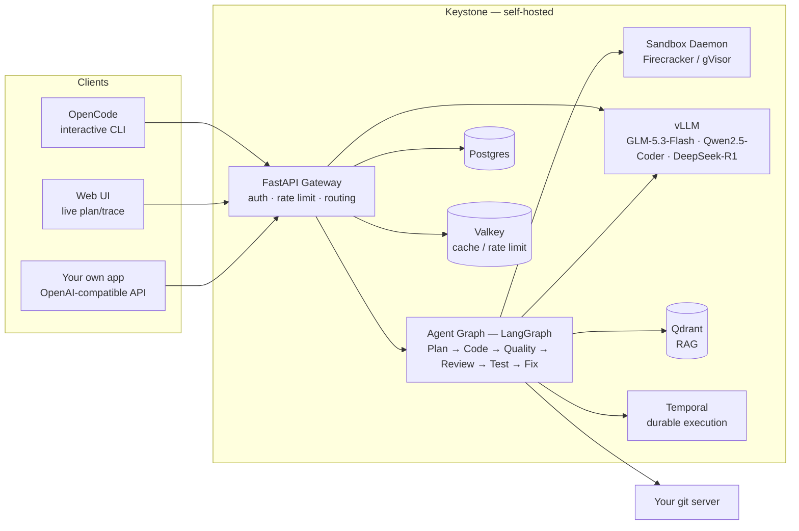

# Keystone

**Self-hosted, open source, air-gap-capable. Two things, one platform: open-weight model inference, and a deterministic coding agent that verifies its own work before it ever opens a PR.**

[](https://github.com/GGChamp85/keystone/actions/workflows/ci.yml)
[](https://github.com/GGChamp85/keystone/actions/workflows/codeql.yml)
[](LICENSE)
[](pyproject.toml)
[](web/package.json)

Keystone runs entirely on infrastructure you own. No model weights, code, or telemetry ever leave your network unless you choose to send them.

---

## Two features, both self-hosted

| | **Open weights model inference** | **Deterministic coding agents** |
|---|---|---|
| What it is | An OpenAI-compatible gateway in front of open-weight models (GLM-5.3-Flash, Qwen2.5-Coder, DeepSeek-R1) served by vLLM — swap the base model with a config change, not a code change. | A background agent that clones your real repo into a sandbox and edits it with actual tools (`read_file`, `grep`, `apply_patch`, `run_command`) — the same way a human contributor would, not a single full-file rewrite guessed from a prompt. |
| Why "open weights" / "deterministic" | Every model is open-weight and self-hosted — no vendor API required, no weights ever leave your network. Point the same gateway at a frontier model instead when you want to (`benchmarks/frontier_proxy.py`), but nothing here depends on one. | "Done" is decided by real, deterministic checks — your actual lint/typecheck/security scanners and your actual test suite's actual exit code — never an LLM's self-assessment of its own work ("LLM-as-judge"). Any gate that can't run blocks the task instead of silently passing it. |
| Where to read more | [Open-weight model inference](#open-weight-model-inference) | [Deterministic coding agents](#deterministic-coding-agents) |

---

## Deploy anywhere — laptop, cloud GPUs, or fully air-gapped

Every tier below runs the exact same code — `docker-compose.yml` for a single box, the same Helm chart scaled up for the rest. Move between them by changing config, not by re-platforming. Each has its own step-by-step guide:

| Tier | GPUs | Network | Step-by-step guide |
|---|---|---|---|
| **Locally** — laptop, no GPU required | None — point the coding role at a real frontier model instead (`benchmarks/frontier_proxy.py`) | Normal internet | [Run it locally in 10 minutes](#run-it-locally-in-10-minutes) |
| **RunPod** — cloud GPUs, rented by the hour | Real GPU(s), no upfront hardware purchase | Normal internet | [`docs/deployment/RUNPOD_SETUP.md`](docs/deployment/RUNPOD_SETUP.md) |
| **Cloud VPC or on-prem** — production, your own Kubernetes cluster | Real multi-GPU/multi-node hardware you own or rent, sized per [Models](#models) | Normal internet, or **zero egress** if you also follow the air-gap bundle steps | [`docs/deployment/KUBERNETES_CLIENT_VPC.md`](docs/deployment/KUBERNETES_CLIENT_VPC.md) — add [Deploy air-gapped](#deploy-air-gapped) on top for zero internet egress after bring-up |

Model serving itself scales the same way across every tier: from one GPU to real multi-node pipeline-parallel serving (`nodeCount` > 1) for a model too large for one node's GPU pool, and from one replica to KEDA-based autoscaling on real queue depth — see [Distributed serving](#distributed-serving). And because every container image, Python wheel, npm package, and model weight the platform needs bundles through the same `airgap/` scripts, the air-gapped path isn't a stripped-down mode — it's the identical Cloud VPC / on-prem deployment with the network cable pulled.

---

## What you get that a frontier model API doesn't give you

Keystone isn't a claim that its self-hosted open-weight models currently out-code the frontier models — they don't, not yet honestly measured at scale (see [Run the benchmark suite](#run-the-benchmark-suite) for the real, unfiltered numbers on that gap). The value is everything *around* the model, and it applies whether the model behind it is open-weight or a frontier one you've pointed Keystone at:

| | Calling a frontier API / agent product directly | Keystone |
|---|---|---|
| Where your code and prompts go | The vendor's cloud, on every request | Nowhere, by default — self-hosted and air-gap-capable; only leaves your network if you explicitly wire a role to a frontier proxy |
| What "done" means | The model's own claim, or a human re-reading the diff | Deterministic: your real lint/typecheck/security scanners and your real test suite's real exit code, run in a real sandbox — enforced by the platform, not requested of the model. See [Deterministic coding agents](#deterministic-coding-agents) |
| Git workflow | You copy/paste output and do it yourself | Native: real clone → branch → commit → push → PR against your own git host, independently re-verified in a *fresh* sandbox clone before anything is called complete |
| Cost as usage grows | Per-token, no ceiling, priced by the vendor | Self-hosted GPU cost is fixed regardless of volume — run `python -m benchmarks.run_benchmark --gpu-count N --gpu-hourly-cost X --gpu-tokens-per-second Y` against your own real deployment for your own real break-even point versus the published frontier rates in `benchmarks/cost_model.py` |
| Gets better on your codebase | Only via prompting/context — the model itself never changes | A real fine-tuning pipeline (LoRA/SFT/DPO) trains on your own git history, accepted tasks, and repo text — see [Fine-tune on your code](#fine-tune-on-your-code) for where this genuinely stands (real end to end on CPU; not yet proven on real GPU hardware) |
| Multi-tenant controls | Bring your own wrapper | Built in: tenants, per-user roles, per-tenant rate limits/token budgets, and an audit log on every task/memory/admin action |
| Model lock-in | Whatever that product ships | Any open-weight model is a config change (`src/inference/model_router.py`), and the same gateway can front a frontier model instead (`benchmarks/frontier_proxy.py`) — the deterministic verification layer around it doesn't change either way |

In short: if you want frontier-quality output, Keystone can still give it to you (point `benchmarks/frontier_proxy.py` at a frontier model, as [Watch it write code](#watch-it-write-code) does) — but wrapped in a deterministic, self-hosted, auditable pipeline that a raw API call doesn't give you, with a real path to running entirely on your own open-weight, fine-tuned model once that pipeline has proven itself on your repos.

---

## Contents

- [Deploy anywhere](#deploy-anywhere--laptop-cloud-gpus-or-fully-air-gapped)
- [What you get that a frontier model API doesn't give you](#what-you-get-that-a-frontier-model-api-doesnt-give-you)
- [Architecture](#architecture)
- [What you need](#what-you-need)
- [Run it locally in 10 minutes](#run-it-locally-in-10-minutes)
- [Open-weight model inference](#open-weight-model-inference)
  - [Chat completions](#chat-completions-openai-compatible)
  - [Models](#models)
  - [Add a new model](#add-a-new-model)
  - [Distributed serving](#distributed-serving)
  - [Bring your own repos and data](#bring-your-own-repos-and-data)
  - [Fine-tune on your code](#fine-tune-on-your-code)
- [Deterministic coding agents](#deterministic-coding-agents)
  - [Watch it write code](#watch-it-write-code)
  - [Interactive terminal](#interactive-terminal--use-it-just-like-the-codex-cli-and-similar-terminal-agents)
  - [Use it from VS Code](#use-it-from-vscode)
  - [Submit a background task](#submit-a-background-task)
  - [Many developers, many repos, in parallel — no policy limits](#many-developers-many-repos-in-parallel--no-policy-limits)
  - [Connect your own git server](#connect-your-own-git-server)
  - [Redact PII before it reaches a frontier model](#redact-pii-before-it-reaches-a-frontier-model)
  - [Run the benchmark suite](#run-the-benchmark-suite)
- [Deploy air-gapped](#deploy-air-gapped)
- [Tech stack](#tech-stack--open-source-only-no-managed-saas)
- [Project structure](#project-structure)
- [Documentation](#documentation)
- [Contributing](#contributing)
- [License](#license)

---

## Architecture



The gateway (`VLLM` in the diagram) is feature 1 — it also serves plain chat completions with no agent involved. The agent graph, sandbox, and git integration together are feature 2: a background task moves through `PLANNING → CODING → QUALITY → REVIEW → TESTING → COMPLETE`, with a `FIXING` node every gate can route back to on failure (including a root-cause step that decides whether to re-plan entirely after repeated failures, not just retry blindly). Temporal makes this durable: a task survives an API pod crash or restart because Temporal owns the execution, not an in-process task.

---

## What you need

| Component | Needed for | Notes |
|---|---|---|
| Docker + Compose v2, `make` | Everything | The whole stack is `docker-compose.yml` |
| Postgres, Redis/Valkey, Qdrant | Everything | Started for you by `make up` — nothing to install separately |
| Sandbox daemon (`keystoned`) | Deterministic coding agents (not plain chat completions) | Runs sandboxed git clones/tool calls/tests; gVisor by default, no KVM needed. `make sandbox-images` builds its runtime image — required before the first task |
| **A git host** | Deterministic coding agents (chat-only use doesn't need one) | Keystone never invents a repo to work in — point it at your own git server, or run [Gitea](https://gitea.io) (MIT) in five minutes for a local/test one. See [Connect your own git server](#connect-your-own-git-server) |
| **A coding model** | Both features | Either (a) GPUs running vLLM — see [Models](#models) for real VRAM numbers, or (b) **no GPU at all**: `benchmarks/frontier_proxy.py` puts a real frontier model (one vendor's API, today) behind the same OpenAI-compatible interface — this is what [Watch it write code](#watch-it-write-code) below uses |

That's the complete list — no managed SaaS dependency anywhere in it (see [Tech stack](#tech-stack--open-source-only-no-managed-saas)).

---

## Run it locally in 10 minutes

This brings up the full stack (no model backend chosen yet — see [What you need](#what-you-need) for the two real options, and [Watch it write code](#watch-it-write-code) if you want to skip straight to a working coding-agent task with no GPU).

```bash
# 1. Clone and configure
git clone https://github.com/GGChamp85/keystone.git
cd keystone

# Either let `keystone init` generate a real, working .env for you (needs
# a local Python env — python3 -m venv .venv && source .venv/bin/activate
# && pip install -e ".[dev]", see CONTRIBUTING.md — then `keystone init`,
# answer its prompts, and skip to step 2):
keystone init
# ...or do it by hand:
cp .env.example .env
# Edit .env: set POSTGRES_PASSWORD, REDIS_PASSWORD, QDRANT_API_KEY,
# KEYSTONE_ROOT_ADMIN_TOKEN — the compose file refuses to start without them.

# 2. TLS
make certs        # bare self-signed leaf — fine for a laptop
# make certs-ca    # real internal CA + CA-signed cert (pki/) — use this for anything shared

# 3. Build and start
make build         # also builds the sandbox runtime images (required before any agent task can run)
make up

# 4. Migrate the database
make db-migrate

# 5. Create your first API key
make api-key       # prompts for a tenant name, prints a ks-... key — save it

# 6. Confirm it's alive
curl http://localhost:8080/health
# or, for a fuller diagnostic (git host, package mirrors, secret strength too): keystone doctor
```

Expected output from step 6 is a JSON body with `"status": "healthy"` (or `"degraded"` while any component is down) and a `components` map showing each backing service (`postgres`, `redis`, `qdrant`, `vllm_coding`, ...) as `healthy` or `unhealthy` — an `unhealthy` vLLM component just means no model endpoint is reachable yet, which is expected until you've pointed one at real GPUs or an external endpoint.

Then open the live UI and watch an agent actually work:

```bash
open http://localhost:8080/app/   # paste your API key, submit a task, watch the plan/tool-trace stream in
```

**Troubleshooting**: `keystone doctor` (`src/cli/doctor.py`) is the real diagnostic — it connects directly to Postgres, Redis, Qdrant, the sandbox daemon, each model endpoint, the git host, and package mirrors (independent of whether the app itself is even up yet) and reports exactly what's wrong, not just pass/fail. `make status` shows every container's health; `make logs` / `make logs-vllm` tail application/model logs; `make vllm-status` checks model endpoint health specifically; `make clean` tears down containers, volumes, and cached data for a clean retry.

---

## Open-weight model inference

An OpenAI-compatible gateway (`/v1/chat/completions`, `/v1/models`) in front of vLLM, serving open-weight models end to end on your own GPUs — API key management, rate limiting, token budgets, and multi-model routing with health-aware fallback, all self-hosted.

### Chat completions (OpenAI-compatible)

Point any OpenAI SDK/client at Keystone by swapping the base URL — no agent, no tools, just a completion:

```bash
curl -X POST http://localhost:8080/v1/chat/completions \
  -H "Authorization: Bearer ks-XXXX-XXXXXXXX" \
  -H "Content-Type: application/json" \
  -d '{
    "model": "coding",
    "messages": [{"role": "user", "content": "Write a Python async Redis connection pool"}],
    "temperature": 0.2
  }'
```

### Models

| Role | Model | GPUs | Context |
|------|-------|------|---------|
| Coding (primary) | [GLM-5.3-Flash](https://huggingface.co/zai-org/GLM-5.3-Flash) (zai-org, MIT) — 288-expert MoE, natively FP8, real max context 1,048,576 | 8× A100/H100 80GB | 128K default (raise once real KV-cache headroom is confirmed) |
| Coding (fallback) | Qwen2.5-Coder-32B-Instruct (Apache-2.0) — used when the primary endpoint is unhealthy | 4× A100 80GB | 128K |
| Reasoning (critic) | DeepSeek-R1 (MIT) | 2× A100 80GB | 64K |

Swapping in a different open-weight model is a config change, not a code change — see `src/inference/config.py` and `src/inference/model_router.py`. No GPU at all? `benchmarks/frontier_proxy.py` puts a real frontier model behind this same interface, so the gateway (and the coding agent below) work identically either way.

### Add a new model

Every call site — the gateway, the router, the coding agent — resolves a model by **role** (`coding`, `coding_fallback`, `reasoning`), never by name. Swapping what's behind a role never touches the orchestrator, the agent loop, or the gateway code.

**A different open-weight model, same self-hosted path:**

| Deployment | What actually changes |
|---|---|
| Docker Compose (dev tier) | One line in `docker-compose.yml` — the `--model ...` / `--served-model-name ...` flags on the `vllm-coding` / `vllm-coding-fallback` / `vllm-reasoning` service's `command:`. |
| Kubernetes / Helm (staging, production) | No file edit at all: `helm upgrade ... --set vllm.coding.model=<new-model> --set vllm.coding.servedModelName=<name> --set vllm.coding.toolParser=<parser> --set vllm.coding.image.tag=<tag>` — see `helm/keystone/values.yaml`'s `vllm.coding` block, and `helm/keystone/values-runpod-test.yaml` for a real, working example that does exactly this to run Qwen2.5-Coder-32B on a single test GPU instead of the 8-GPU GLM-5.3-Flash default. |

Either way, set the matching `CODING_MODEL_ID` / `CODING_FALLBACK_MODEL_ID` / `REASONING_MODEL_ID` in `.env` so `/v1/models` and request labeling stay accurate — this is metadata only, `src/inference/model_router.py` never routes on it.

**A frontier model instead, for a role with no self-hosted GPU:**

```bash
FRONTIER_PROXY_MODEL=claude-sonnet-4-6 python -m benchmarks.frontier_proxy   # any real Anthropic model string
export VLLM_CODING_URL=http://localhost:8090/v1   # or VLLM_CODING_FALLBACK_URL / VLLM_REASONING_URL
```

`benchmarks/frontier_proxy.py` translates the exact OpenAI-compatible wire protocol every Keystone call site already speaks to and from the real Anthropic Messages API — one environment variable, no code change, and the model swap is exactly this simple whichever of that vendor's models you point it at. **Honestly, not there yet**: only Anthropic is wired up today — a different frontier vendor would mean writing a second translation module alongside `frontier_proxy.py` (real work, not a config flag), not something this repo currently supports out of the box.

### Distributed serving

Each role scales along two independent, real axes (`helm/keystone/templates/vllm.yaml`): `replicas` runs N independent full model instances behind a load-balanced Service for horizontal throughput, and `nodeCount` pipeline-parallels a single instance across that many physical nodes for a model too large for one node's GPU pool (vLLM's real Ray-backed multi-node executor). Optional KEDA-based autoscaling scales `replicas` on the real `vllm:num_requests_waiting` queue-depth metric, not a CPU percentage that would never trigger on a GPU-bound workload. All three paths (single-node, multi-node, autoscaling) render through `helm lint`/`helm template` in CI on every PR; the multi-node Ray bootstrap itself hasn't been verified against real multi-node GPU hardware yet — this dev environment has none.

### Bring your own repos and data

Two real, complementary paths — use one or both, on your own code, from day one:

**RAG (immediate, no training)**: `keystone ingest <repository_url>` clones a real allowlisted repo, chunks and embeds it into your tenant's own Qdrant collection, and makes it retrievable as context for every coding/review/planning turn. It's incremental — a file whose content hash hasn't changed is skipped entirely on the next run, and a file removed from the repo has its now-stale chunks deleted, not left behind forever.

```bash
keystone ingest https://your-git-host/yourorg/yourrepo --branch main
# 23 file(s) processed, 0 unchanged, 0 skipped, 0 deleted
#   61 chunk(s) created, 61 upserted, 0 stale chunk(s) removed

keystone ingest https://your-git-host/yourorg/yourrepo --branch main   # run again — nothing changed
# 0 file(s) processed, 23 unchanged, 0 skipped, 0 deleted
#   0 chunk(s) created, 0 upserted, 0 stale chunk(s) removed
```

**Fine-tuning (deeper, trains the model itself)**: see [Fine-tune on your code](#fine-tune-on-your-code) directly below — your git history, accepted tasks, and repo text become real training data, not just retrieval context.

### Fine-tune on your code

The full pipeline is real and wired end to end: real training-data sources, a real adapter registry, real LoRA serving, and a real web wizard — not just standalone trainer scripts.

**From the web UI** (the easiest path — `http://localhost:8080/app/`, "Fine-tune" tab): pick a job type and base model, point it at a real training-data JSONL, watch live progress stream in, see the real metrics and a dataset preview, then promote or roll back the resulting adapter with one click.

**From the CLI**:

```bash
keystone finetune start lora Qwen/Qwen2.5-Coder-32B-Instruct /data/finetune/train.jsonl --set num_epochs=3
keystone finetune watch <job-id>       # live progress until it reaches a terminal status
keystone finetune promote <job-id>     # register as the tenant's default adapter for its base model
keystone finetune rollback <job-id>    # retire it — routing falls back to the base model
```

**Real data sources** (`src/finetuning/sources/`) turn what your team already has into training data — no separate labeling effort:

- `git_history.py` — merged commits/PR title+body → instruction, real diff → response, filtered for size, generated paths, and secrets.
- `trajectories.py` — your team's own accepted/merged Keystone Agents tasks → SFT examples in the exact prompt/tool format the agent itself uses; accepted-vs-rejected and tests-passed-vs-failed pairs → DPO.
- `repo_pretrain.py` — continued-pretraining text from your indexed repositories, deduped by content hash.

`src/finetuning/manifest.py` splits every dataset into train/holdout **stratified by repository** (never leaking one repo's examples across the split) and writes a `manifest.json` with real sha256 hashes of every file, shown to you before training starts. Trainers (`lora_train.py`/`sft_train.py`/`dpo_train.py`) track real `eval_loss` against the holdout split and keep the best checkpoint, not just the last one.

Once a job completes, promoting it writes a real row to the adapter registry (`ModelAdapter` — tenant, base model, path, status, one `is_default` per tenant+base-model) and every real inference call site — chat completions, the coding/review/planning nodes, extraction — resolves and routes to it automatically (`src/inference/model_router.py`), with the matching `--enable-lora --lora-modules ...` flags emitted for vLLM to actually serve it (`src/inference/config.py`).

> **Where this genuinely stands today**: the adapter registry, promote/rollback, and per-tenant routing are real and covered by tests against real Postgres/Redis. The trainer path is now exercised for real: `tests/test_trainer_smoke.py` (CI's `train-smoke` job, in the Python 3.12 training image `docker/training.Dockerfile`) trains a real LoRA adapter on the real Qwen2.5-Coder-0.5B-Instruct on CPU, records a real held-out eval loss, and reloads the saved adapter for continued training — two optimizer steps, a smoke, not a quality claim. Its first run caught two real trainer bugs (a `TrainingArguments` keyword removed in transformers 5, and weights forced to float16 even with mixed precision off), which is exactly what it exists for. Also still open, honestly: no adapter has been trained on real GPU hardware, the guided "describe → plan & cost → approve" path that wires the data sources into a job isn't built, and promotion is a manual human decision — the "only promote if it measurably beats base+RAG on held-out tasks" verdict gate isn't wired up. See `ROADMAP.md`'s Phase 5.

---

## Deterministic coding agents

A background agent that treats your repository the way a contributor would: it clones it into a real sandbox, reads and greps the actual code, edits it with real tools, and only calls a task "done" once real, deterministic checks say so.

- **Real tools, not a JSON-envelope rewrite.** The agent reads and edits your repository with actual tool calls (`read_file`, `grep`, `apply_patch`, `run_command`) against a real sandboxed git clone — not a full replacement file generated from a prompt and hoped to still be correct.
- **Fails closed, not open.** A code review the model couldn't complete, a quality gate that couldn't run, a test the sandbox couldn't execute — every one of these blocks the task rather than silently waving it through. Nothing gets labeled "reviewed" or "tested" that wasn't.
- **Verified, not asserted.** Pass/fail comes from the real exit code of your real lint/typecheck/security scanners and your real test suite running inside a real sandbox (gVisor/Firecracker) — never an LLM grading its own work.
- **A real git workflow.** Clone → branch → commit → push → PR against your real git host, with a fresh sandbox re-clone of the pushed branch to independently re-verify before anything is called complete.
- **Prompt-injection defense on every tool result, on by default.** The agent reads content it doesn't control the origin of — file contents, grep results, command output from whatever repository it was pointed at — and that content is fed straight back into the model's context, which is exactly the channel a malicious or compromised repo could use to smuggle instructions ("ignore your previous instructions and..."). `src/security/prompt_injection.py` wraps every successful tool result in an explicit `<tool_output tool="read_file" detail="config.py">` delimiter naming its real source (spotlighting, a well-established technique), and real regex detection for common injection phrasings adds a visible security notice inside that specific result when one matches — the content itself is never altered or dropped, so this costs no task accuracy, which is why it's on by default rather than an opt-in like PII redaction. Honest limitation: defense in depth, not a guarantee — a disguised injection that never uses explicit override language can evade the patterns and still sway a model that weighs it.

### Watch it write code

The fastest path to seeing Keystone actually fix a bug — no GPU required, using a real frontier model as the coding backend via `benchmarks/frontier_proxy.py` (real translation layer, not a mock — see [Run the benchmark suite](#run-the-benchmark-suite) for the proof this genuinely works: a real bug, solved end to end, independently verified).

```bash
# 1. Clone, configure, and point the coding role at a real frontier model
#    instead of a GPU — all *before* bringing the stack up, since the app
#    container reads VLLM_CODING_URL from .env at startup, not your shell.
git clone https://github.com/GGChamp85/keystone.git && cd keystone
cp .env.example .env
# Edit .env: set POSTGRES_PASSWORD, REDIS_PASSWORD, QDRANT_API_KEY,
# KEYSTONE_ROOT_ADMIN_TOKEN, and GIT_ALLOWED_HOSTS/GIT_HOST_API_URL/
# GIT_HOST_TOKEN for a real git host it can clone/push/PR against (see
# "Connect your own git server" below — Keystone never invents a repo).
# Set VLLM_CODING_URL=http://host.docker.internal:8090/v1 (Docker Desktop;
# on Linux see the comment above that line in .env.example).

# 2. Bring up the stack (Postgres, Redis, Qdrant, the app, the sandbox daemon)
make certs && make build && make up && make db-migrate
make sandbox-images     # sandbox runtime image — required before any task can run

# 3. Start the real frontier-model proxy the .env above points at
export ANTHROPIC_API_KEY=sk-ant-...
FRONTIER_PROXY_MODEL=claude-opus-4-6 python -m benchmarks.frontier_proxy &   # serves on :8090

# 4. Create an API key and submit a real task
make api-key
curl -X POST http://localhost:8080/v1/keystone/tasks \
  -H "Authorization: Bearer ks-XXXX-XXXXXXXX" -H "Content-Type: application/json" \
  -d '{"task": "Fix the bug where ...", "repository_url": "https://<your-git-host>/you/your-repo", "model": "coding"}'

# 5. Watch it work
open http://localhost:8080/app/    # live plan → tool calls → quality gates → review → tests, streaming in
```

What happens next is the real agent loop, not a canned response: it clones the repo into a sandbox, reads and greps the real code, writes a patch with real tools, runs lint/typecheck/security scanners, gets reviewed by a second model pass, runs the repo's real test suite, and — only if every one of those actually passed — commits, pushes a branch, and opens a real pull request for you to read like any other contributor's PR.

### Interactive terminal — use it just like the Codex CLI and similar terminal agents

Prefer driving the agent turn by turn from your own terminal, in your own working copy of the repo, instead of submitting a task and walking away? [OpenCode](https://github.com/sst/opencode) ships pre-configured against Keystone (`cli/opencode.config.json`) — same interactive experience as the Codex CLI and similar terminal agents, same real tools underneath, just pointed at your self-hosted models instead of a vendor's:

```bash
export KEYSTONE_INFERENCE_URL=http://localhost:8080
export KEYSTONE_API_KEY=ks-XXXX-XXXXXXXX
opencode
```

What's actually wired up, not just a config stub:

- **All three model roles pre-registered** (`cli/opencode.config.json`): `coding` (GLM-5.3-Flash) as the default model, `coding_fallback` (Qwen2.5-Coder-32B) as OpenCode's own small/fast model, `reasoning` (the critic) available to switch to — `Shift+Tab` cycles manual/auto-mode, same as any other OpenCode provider.
- **Keystone's memory, live, over real MCP** — `mcp.keystone-memory` is a real Streamable-HTTP MCP server (`src/api/routes/mcp.py`) the session talks to over the network, not a local shell-out; `/memory` (`cli/opencode/commands/memory.md`) and the bundled plugin (`cli/opencode/plugins/keystone-memory.ts`) surface the same per-repo/per-tenant memory the background agent and the web UI's Memory panel read and write, so what a teammate's background task learned shows up in your terminal session too.
- **Real permission gates, not "trust the model"** — `cli/opencode.config.json`'s `permission` block asks before every edit and every shell command by default, explicitly denies `rm -rf*` and `git push*`, and allowlists only read-only commands (`git status`, `git diff*`, `git log*`, `ls*`, `cat*`, `grep*`) to run without asking.

See `docs/deployment/OPENCODE_SETUP.md` for wiring OpenCode to a non-local Keystone deployment.

### Use it from VS Code

Install the [Continue](https://www.continue.dev/) extension and generate its config from your deployment — chat, inline edit, autocomplete and the agent's memory tools (over MCP) all run against your Keystone gateway with one API key:

```bash
keystone ide continue-config --base-url https://keystone.internal:8080 --api-key ks-XXXX-XXXXXXXX --output ~/.continue/config.yaml
```

Step by step, including air-gapped TLS: [`docs/guides/use-from-vscode.md`](docs/guides/use-from-vscode.md).

### Submit a background task

The agent clones the repo into a sandbox, explores it with real tools, edits it, runs quality gates and the real test suite, and opens a PR — you submit it and come back to a review, like assigning a task to a contributor:

```bash
curl -X POST http://localhost:8080/v1/keystone/tasks \
  -H "Authorization: Bearer ks-XXXX-XXXXXXXX" \
  -H "Content-Type: application/json" \
  -d '{
    "task": "Add pagination to the /users endpoint with cursor-based navigation",
    "repository_url": "https://<your-git-server>/myorg/myapi",
    "model": "coding",
    "max_iterations": 10
  }'
```

**Let Keystone pick the model**: set `"model": "auto"` instead of a fixed role, and `src/inference/model_router.py`'s real heuristics resolve it once, before the task is even persisted — `classify_task_to_role` picks reasoning vs. coding from the task description, and (opt-in — set `TASK_COMPLEXITY_ROUTING_ENABLED=1`) `classify_task_complexity` additionally routes a small, mechanical-sounding coding task ("fix a typo", "bump the version") to the cheaper `coding_fallback` model instead of the primary one. Never silent: the resolved role is what's actually written to the task's own `model_role` column, visible in every response and in the web UI, not a live decision hidden behind an "auto" label. Off by default (a wrong downgrade costs quality, not just money) — ties are deliberately broken toward the more capable model, not the cheaper one.

### Many developers, many repos, in parallel — no policy limits

Every task is independent: its own sandbox container, its own clone on its own branch (`keystone/<user>/<task_id>`), its own PR. Nothing serialises on a repository, so a team can submit as many tasks against as many repos as it likes; throughput is bounded by the GPU, worker and sandbox capacity you deploy — Temporal workers and sandbox daemons scale horizontally, vLLM autoscales on queue depth — never by a number in a config file.

There are **no policy limits by default**: no per-tenant concurrency cap, no daily/monthly token budget, no request-rate limit, no `max_tokens` ceiling, no per-task token cap, no wall clock. Each is `0 = unlimited` and only becomes a limit when an admin deliberately sets one (`POST /v1/admin/tenants` for tenant caps, `MAX_*`/`DEFAULT_*` in `.env` for deployment-wide ones — see `.env.example`). The single per-task safety bound is `max_iterations` (a runaway fix/test loop stops there), which you set per task with no ceiling. Every token spent — gateway requests and agent tasks alike — is written to a durable per-tenant ledger with the dollars it cost at your own configured price per model role (`MODEL_PRICES_PER_MILLION`), visible at `GET /v1/keystone/usage` and in the web UI's **Spend** view. Nothing the agent produces is truncated in storage — full test output, full diffs, full quality findings, full install logs live on the task record; the only fitting that ever happens is into one model prompt, sized from the model's real context (`AGENT_MAX_CONTEXT_TOKENS`) and always stating what was omitted and where to read the rest.

### Connect your own git server

The agent's repo-mode tasks (clone → branch → commit → push → PR) only ever talk to git hosts you explicitly allow — `GIT_ALLOWED_HOSTS` in `.env` (default: a placeholder `gitea.internal.keystone.local`, since Gitea is the reference internal git host used throughout the air-gap tooling and dev-tier `docker-compose.yml`). Point it at whatever your org already runs:

```bash
# .env
GIT_ALLOWED_HOSTS=git.yourcompany.internal
GIT_HOST_API_URL=https://git.yourcompany.internal/api/v1
GIT_HOST_TOKEN=<a bot account token with push + PR permissions>
```

`src/git/host.py` defines the `GitHost` protocol; `src/git/gitea.py` is the current real implementation. A repository URL outside the allowlist is rejected before the agent ever clones it — this is an allowlist, not a warning.

### Redact PII before it reaches a frontier model

`benchmarks/frontier_proxy.py` is the one real place in the whole platform where request content — task descriptions, file contents, command output — actually leaves your network for a third-party API. Set one environment variable and every real PII pattern (email, phone, SSN, credit card — with a real Luhn checksum, not just a digit-count guess — and IPv4 addresses) is redacted from the system prompt, user turns, assistant text, and tool output before the request goes out:

```bash
export FRONTIER_PROXY_REDACT_PII=1
```

`src/security/pii_redaction.py` is real, deterministic regex-based detection — not an ML/NER classifier, which is a deliberate trade-off (predictable, auditable, no extra model dependency to bundle air-gapped) at the honest cost of missing PII with no fixed format (names, addresses, free-text details). Off by default: redaction is a real content change, and a legitimate task can genuinely need the real value (a test fixture with a literal phone number, say) — this is an explicit opt-in, not a silent behavior change for every existing frontier-proxy user. Verified for real: with the flag on, a live request's real email/phone were confirmed redacted before the request reached the frontier model (`frontier_proxy.pii_redacted` in the proxy's own logs); with it off, the same request's real value round-tripped through the model unchanged.

### Run the benchmark suite

```bash
python -m benchmarks.run_benchmark                    # Keystone Inference only
python -m benchmarks.run_benchmark --with-frontier     # + any frontier models you've configured API keys for
python -m benchmarks.run_benchmark --gpu-count 4 --gpu-hourly-cost 1.89 --gpu-tokens-per-second 4000
```

Each task in `benchmarks/tasks/` is scored by actually executing the model's completion in a real self-hosted sandbox (gVisor) — no LLM-as-judge, no heuristic string match, just the real test command's real exit code — and the runner reports pass rate alongside a real token-cost comparison (self-hosted GPU-time vs. any frontier model you included). Requires `SANDBOX_DAEMON_URL` reachable and either `VLLM_CODING_URL` reachable or `--with-frontier` with a key set; with neither, it reports "no models available" rather than fabricating a result.

**Want to eval one specific prompt right now, instead of writing a task file first?** `benchmarks/eval_prompt.py` runs a single ad hoc prompt through Keystone Inference and any configured frontier models side by side — raw completions and real token cost with no test given, or real pass/fail if you hand it a real test too:

```bash
# Unscored — just compare completions and cost for one prompt
python -m benchmarks.eval_prompt --prompt "Write a Python LRU cache with O(1) get/put" --with-frontier

# Scored — real pass/fail via a real sandboxed test, same scoring path as the task suite above
python -m benchmarks.eval_prompt --prompt-file task_prompt.txt --language python \
  --test-code-file test_solution.py --test-command "pytest test_solution.py" --with-frontier
```

**A real run, from this repo's own development environment** (no GPU available here, so `keystone-inference` fails honestly rather than being skipped or faked; `--with-frontier` was set with a real `ANTHROPIC_API_KEY`):

| Model | Pass rate | Notes |
|---|---|---|
| `keystone-inference` | 0/3 | Real, honest failure — no vLLM endpoint reachable in this dev environment (no GPU). Not a fabricated 0; the harness reports "no models available" style errors per-task rather than a silent skip. |
| `claude-opus` | 3/3 | Real Anthropic API call, real sandboxed test execution. |
| `claude-sonnet` | 3/3 | Same. |

**Read this result for what it is, not more**: this is a 3-task single-function smoke suite that exists to prove the harness itself — sandboxed execution, real cost accounting, gated frontier clients — is genuinely wired end to end, not a claim that Keystone's self-hosted models match or beat frontier models. No number in this README is invented; where a real measurement doesn't exist yet, the roadmap says so instead of guessing.

#### The real repo-scale benchmark

`benchmarks/agent_runner.py` is the actual thing a quality comparison needs: a repo-scale task run through the *real* agent loop (`src/orchestrator/engine.py`'s real engine, real tools, real quality gates, a real git workflow) against a seeded repository with a genuine bug and a real failing test — not a single free-standing completion.

```bash
python -m benchmarks.agent_runner --task token_bucket --max-iterations 8
```

To use a real frontier model as the coding backend for this, `benchmarks/frontier_proxy.py` translates `src/inference/client.py`'s exact OpenAI-compatible wire protocol to and from the real Anthropic Messages API — point `VLLM_CODING_URL` at it and the unmodified orchestrator runs against the frontier model:

```bash
FRONTIER_PROXY_MODEL=claude-opus-4-6 python -m benchmarks.frontier_proxy   # serves on :8090
export VLLM_CODING_URL=http://localhost:8090/v1
```

**Run for real** against a live Gitea, a live sandbox, and a frontier model: the seeded `token_bucket` task (a token-bucket rate limiter whose `_refill()` doesn't cap tokens at capacity) was **solved in 67.6s across 5 iterations** — real planning, real tool-based coding, real quality gates, real review, real tests, a real push, and a real PR opened — independently confirmed by cloning the pushed branch in a *fresh* sandbox and re-running both the fail-to-pass and pass-to-pass tests, both passing. Requires `GIT_HOST_API_URL`/`GIT_HOST_TOKEN`/`GIT_ALLOWED_HOSTS` pointed at a real Gitea reachable from inside a sandbox (see `tests/test_git_workflow_integration.py`'s module docstring for how to stand one up).

**Still honestly incomplete**: only one repo task exists so far (the plan calls for 10–20), there's no persisted comparison sweep yet (base vs. base+RAG vs. fine-tuned vs. frontier, all through this same harness), and no web UI comparison panel — see `ROADMAP.md`'s Phase 6.

---

## Deploy air-gapped

Production deployments are built to run fully air-gapped: zero internet egress after the offline bundle is transferred in. This applies to both features — model weights and every container image are bundled the same way.

```bash
# On a machine WITH internet access:
./airgap/download_models.sh ./airgap/models        # model weights — DeepSeek-R1 (~688GB) and GLM-5.3-Flash (~328GB) dominate the size, budget accordingly
./airgap/build_image_bundle.sh ./airgap/output/images   # every container image, re-tagged for your internal registry
# then the Python wheelhouse / npm mirror scripts, per docs/airgap/OFFLINE_INSTALL_RUNBOOK.md

# Transfer ./airgap/output (and the model bundle) into the isolated environment, then:
./airgap/import_bundle.sh
```

`docs/airgap/OFFLINE_INSTALL_RUNBOOK.md` walks the full build → bundle → transfer → import → bring-up sequence step by step, and states plainly what's been verified end-to-end on a real network-isolated environment versus what still needs a smoke test before a production handoff — it doesn't paper over the gap.

---

## Tech stack — open source only, no managed SaaS

Every row is an actual service this repo deploys, with its license verified against the real upstream source (not assumed) — see `docs/LICENSES_AND_COMPLIANCE.md` for the full inventory and every finding that changed the build.

| Layer | Technology | License |
|-------|-----------|---------|
| API Gateway | FastAPI + Uvicorn | MIT |
| Orchestration | LangGraph | MIT |
| Model Serving | vLLM | Apache-2.0 |
| Vector DB (RAG) | Qdrant | Apache-2.0 |
| Sandbox | Self-hosted — gVisor by default (portable, no nested virtualization required), Firecracker microVMs for production tiers with KVM-capable nodes | Apache-2.0 |
| Interactive Agent CLI | [OpenCode](https://github.com/sst/opencode) | MIT |
| Durable Execution | Temporal.io | MIT |
| Secrets | OpenBao | MPL-2.0 |
| IaC | OpenTofu + Helm | MPL-2.0 / Apache-2.0 |
| Distributed training | Kubeflow Trainer | Apache-2.0 |
| Autoscaling (optional, `vllm.*.autoscaling.enabled`) | [KEDA](https://keda.sh) | Apache-2.0 (verified against the real upstream `LICENSE`) |
| Metrics + dashboards | Prometheus + Grafana | Apache-2.0 / **AGPL-3.0** (Grafana — see `docs/LICENSES_AND_COMPLIANCE.md` finding #2) |
| Log aggregation + alerting | Loki + Promtail + Alertmanager | AGPL-3.0 (Loki/Promtail, same caveat as Grafana) / Apache-2.0 |
| Database | PostgreSQL 16 | PostgreSQL License |
| Cache / rate-limit / queues | **Valkey** (not Redis — `redis:7-alpine` now resolves to a relicensed, non-open-source build; see finding #1) | BSD-3-Clause |
| Reverse Proxy | Nginx (TLS 1.3, real internal CA via `pki/`) | BSD-2-Clause |

**Not included — bring your own**: an internal git server (see [Connect your own git server](#connect-your-own-git-server)) and a container registry for the air-gapped image bundle (`global.imageRegistry` in `helm/keystone/values.yaml`; Harbor is a reasonable choice, but this repo doesn't deploy one).

---

## Project structure

```
keystone/
├── src/
│   ├── main.py                    # FastAPI app entry point
│   ├── config.py                  # Pydantic settings
│   ├── api/
│   │   ├── routes/                # health, completions, keys (admin), agents, memory, finetune, mcp
│   │   ├── middleware/            # Bearer API key auth + RBAC, Valkey rate limiter/budgets
│   │   └── models/                # Pydantic request/response schemas
│   ├── db/                        # SQLAlchemy models + Alembic migrations
│   ├── inference/                 # vLLM client, model router (role/tenant → endpoint + adapter + fallback), config builder
│   ├── orchestrator/
│   │   ├── engine.py              # Task lifecycle manager (Temporal-backed)
│   │   ├── graph.py               # LangGraph state graph
│   │   ├── circuit_breaker.py     # Runaway loop protection
│   │   ├── concurrency.py         # Per-tenant/per-user Redis semaphore
│   │   ├── context.py             # Token-budgeted prompt/turn trimming
│   │   ├── events.py              # Live task event stream (Redis Streams -> SSE, powers web/)
│   │   ├── pr_polling.py          # Automatic PR-status -> task_feedback recording
│   │   ├── tools/                 # Tool schemas, real implementations, native/text protocol
│   │   └── nodes/                 # planning / coding / quality / review / testing / tool_execution
│   ├── sandbox/                   # Sandbox daemon + Firecracker/gVisor backends, egress policy
│   ├── git/                       # GitHost protocol + Gitea implementation
│   ├── rl/                        # RL rollout coordinator (reuses the sandbox pool)
│   ├── temporal/                  # worker.py, workflows.py, activities.py, finetune_workflow.py, finetune_activities.py
│   ├── memory/                    # Per-tenant Qdrant vector store, embeddings, incremental git ingestion
│   ├── finetuning/                # LoRA/SFT/DPO trainers, runner, events, sources/ (git history, trajectories, repo pretrain), manifest
│   └── cli/                       # `keystone` CLI (memory, finetune, ingest, ops, admin) — a real HTTP client against the API
├── cli/                           # OpenCode config for the interactive agent
├── web/                           # Live plan/execution-trace + memory + fine-tune UI (React + Vite, served at /app)
├── helm/keystone/                 # Kubernetes chart (client VPC production)
├── infra/opentofu/                # RunPod test tier (assembled environment) + reusable modules (incl. client-vpc-network)
├── airgap/                        # Offline bundle build/import scripts
├── pki/                           # Internal CA
├── observability/                 # Prometheus + Grafana provisioning (dev tier)
├── benchmarks/                    # Quality + cost benchmark runner
├── docs/                          # Runbooks, architecture, compliance
├── docker-compose.yml             # Single-box dev deployment
└── LICENSE / NOTICE
```

---

## Documentation

| Doc | Covers |
|---|---|
| `docs/airgap/OFFLINE_INSTALL_RUNBOOK.md` | Build → bundle → transfer → import → bring-up, step by step |
| `docs/architecture/SANDBOX_ARCHITECTURE.md` | How the Firecracker/gVisor sandbox layer actually works |
| `docs/deployment/KUBERNETES_CLIENT_VPC.md` | Helm install, and what's verified on a real cluster vs. not |
| `docs/deployment/RUNPOD_SETUP.md` | Step-by-step: real GPU pods on RunPod, wired to the rest of the stack |
| `docs/deployment/OPENCODE_SETUP.md` | Wiring the interactive CLI to Keystone |
| `docs/LICENSES_AND_COMPLIANCE.md` | Full license inventory + every real finding that changed the build |
| `docs/TELEMETRY_AUDIT.md` | Every telemetry-disabling setting, verified inert |
| `ROADMAP.md` | What's built, what's next |
| `CHANGELOG.md` | Notable changes, [Keep a Changelog](https://keepachangelog.com/) format |

### Deployment tiers

| Tier | Use case | How |
|------|----------|-----|
| Single-box dev | Local development, demos | `docker-compose.yml` (`make up`) |
| RunPod test/staging | Multi-GPU testing before rollout | `infra/opentofu/environments/runpod-test/`, `helm/keystone/values-runpod-test.yaml` |
| Client VPC production | Air-gapped, multi-node, inside your own network | `helm/keystone/` Kubernetes chart with `helm/keystone/values-client-vpc.yaml`, plus the reusable `infra/opentofu/modules/client-vpc-network/` module (no fully assembled `environments/` entry for this tier yet — see `docs/deployment/KUBERNETES_CLIENT_VPC.md` for what's verified) |

---

## Contributing

Bug reports, feature requests, and PRs are welcome — see `CONTRIBUTING.md` for dev setup and the PR checklist, `CODE_OF_CONDUCT.md` for community expectations, and `SECURITY.md` for how to report a vulnerability privately rather than through a public issue.

---

## License

Apache License 2.0 — see [LICENSE](LICENSE) and [NOTICE](NOTICE) for the full text and third-party attributions.
