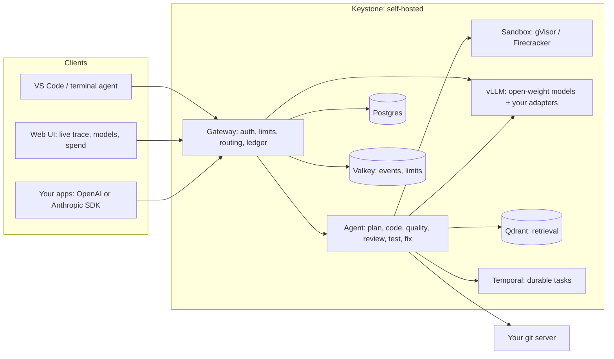

# Keystone

**Run AI coding on infrastructure you own.** Keystone is a self-hosted, open-source platform with two parts: a gateway that serves open-weight language models through the OpenAI and Anthropic APIs your tools already speak, and a coding agent that changes your code the way a careful engineer does — in a sandbox, with real tests, ending in a pull request you review.

[](https://github.com/GGChamp85/keystone/actions/workflows/ci.yml)
[](https://github.com/GGChamp85/keystone/actions/workflows/codeql.yml)
[](LICENSE)
[](pyproject.toml)
[](web/package.json)

Nothing leaves your network unless you choose to send it: not your code, not your prompts, not the model weights, not telemetry. It runs on a laptop, on rented cloud GPUs, on your own Kubernetes cluster, or fully air-gapped, with the same code and configuration at every tier.

---

## Why teams choose it

| | What it means for you |
|---|---|
| **Your code stays yours** | Models run on your GPUs. The one optional path to a frontier model is explicit, per role, and can redact personal data before anything crosses the boundary. |
| **Verified, not asserted** | A task is "done" only when your real linters, type checkers, security scanners and test suite pass inside a sandbox. A check that cannot run blocks the task instead of waving it through. |
| **A real engineering workflow** | Clone, branch, commit, push, pull request, on your own git server, then an independent re-verification of the pushed branch. Every step is streamed live and kept on the task record. |
| **Gets better on your codebase** | A guided fine-tune turns your git history and accepted tasks into a small model adapted to your conventions, promoted only if it measurably beats the base model, and served within seconds. |
| **No lock-in, no ceiling** | Every model is a configuration choice. There are no policy limits by default: capacity is what you deploy, and every token is written to a dollar ledger you can read. |
| **Open source, end to end** | Apache-2.0. Every component is open source with its license verified, and the whole stack bundles for offline installation. |

---

## What you get

| Capability | In one line |
|---|---|
| **Model gateway** | `/v1/chat/completions` and `/v1/messages` (Anthropic-compatible) in front of vLLM: tools, structured output, streaming with real token usage, API keys, rate limits, budgets, a per-tenant spend ledger. |
| **Model Library and Playground** | Which models are up right now, what each needs, and a place to try one before wiring it into an IDE. |
| **Coding agent** | Plan, code with real tools, quality gates, review, tests, fix, pull request. Durable execution: a task survives a restart. |
| **Fine-tuning** | Describe, review the plan and cost, approve, watch it train, verdict, promote. Runs on one 24 GB GPU. |
| **Memory and retrieval** | Per-repository, per-tenant memory the agent learns from and a human can inspect, pin or forget; incremental indexing of your repositories. |
| **Multi-tenant controls** | Tenants, users and roles, scoped API keys, an audit log on every task, memory, fine-tune and admin action. |
| **IDE and terminal** | VS Code through the Keystone extension (submit tasks, watch the trace, search memory) or the Continue extension (chat, edit, autocomplete), an interactive terminal agent (OpenCode), and a web UI with a live trace of every task. |
| **Operations** | Prometheus, Grafana, Loki and alerting; health and readiness endpoints; Helm chart with multi-node serving and autoscaling. |

---

## Get running

| Where | GPU | Time | Guide |
|---|---|---|---|
| **Laptop** | none (a real 0.5 B model on CPU, and optionally a frontier model for the agent) | 10 minutes | [Quickstart](docs/getting-started/quickstart.md) |
| **One GPU (24 GB)** | serves Qwen2.5-Coder-7B and fine-tunes it | 20 minutes | [Quickstart, Track B](docs/getting-started/quickstart.md) and [Hardware sizing](docs/getting-started/hardware-sizing.md) |
| **Cloud GPUs by the hour** | RunPod Serverless, scaled to zero when idle | 15 minutes | [RunPod](docs/deployment/RUNPOD_SETUP.md) |
| **AWS, Azure or Google Cloud pilot** | one 24 GB GPU node on a managed Kubernetes cluster, from `keystone deploy cloud` | an hour | [AWS](docs/guides/deploy-aws.md), [Azure](docs/guides/deploy-azure.md), [Google Cloud](docs/guides/deploy-gcp.md) — validated, not yet applied to a live account ([verification log](docs/deployment/verification-log.md)) |
| **Production** | your Kubernetes cluster, multi-node, optionally air-gapped | half a day | [Kubernetes](docs/deployment/KUBERNETES_CLIENT_VPC.md), [Air-gapped install](docs/airgap/OFFLINE_INSTALL_RUNBOOK.md) |

The laptop path, in full:

```bash
git clone https://github.com/GGChamp85/keystone.git && cd keystone
python3 -m venv .venv && source .venv/bin/activate && pip install -e ".[dev]"
keystone init --backend demo-cpu     # writes .env with strong secrets; coding role -> the demo model
make certs && keystone up --with-demo-model
keystone doctor                       # every service and model endpoint, reported individually
open http://localhost:8080/app/       # Models, Playground, Tasks, Fine-tune, Memory, Spend
```

Then create a key and make a request (the quickstart shows the exact commands):

```bash
curl -s http://localhost:8080/v1/chat/completions \
  -H "Authorization: Bearer $KEYSTONE_API_KEY" -H "Content-Type: application/json" \
  -d '{"model":"coding","messages":[{"role":"user","content":"Write a Python async Redis connection pool"}]}'
```

Any OpenAI or Anthropic SDK works by changing its base URL. Guides: [the gateway API](docs/guides/gateway-api.md), [the coding agent](docs/guides/coding-agent.md), [VS Code](docs/guides/use-from-vscode.md), [fine-tuning](docs/guides/fine-tune-slm-on-your-repo.md).

---

## How it works



A request to the gateway is authenticated, rate-limited, routed to a model role (`coding`, `coding_fallback`, `reasoning`) with health-aware fallback, served by vLLM, and written to the spend ledger. A coding task moves through planning, coding with real tools, quality gates, review, tests and fixing, in a sandbox that holds a clone of your repository, and ends in a pull request. Temporal owns the execution, so a task survives an API restart. The models behind the roles are open-weight and self-hosted; swapping one is a configuration change.

---

## What it needs

| Component | Needed for | Notes |
|---|---|---|
| Docker with Compose v2 | everything | the whole stack is one compose file; Helm for Kubernetes |
| A coding model | everything | a GPU running vLLM (see [Hardware sizing](docs/getting-started/hardware-sizing.md)), the CPU demo model for evaluation, or a frontier model behind the same interface |
| A git server | the coding agent | any Gitea-compatible host you run; the agent only talks to hosts you allow |
| Postgres, Valkey, Qdrant, Temporal | everything | started for you; nothing to install separately |

Default models: GLM-5.3-Flash (MIT) as the primary coder on 8×80 GB, Qwen2.5-Coder-32B (Apache-2.0) as the fallback on 4×80 GB, DeepSeek-R1 (MIT) as the reviewer on 2×80 GB. A single 24 GB GPU serving Qwen2.5-Coder-7B is a supported, tested configuration for smaller teams.

---

## Proof, not promises

Every claim in this repository is tied to a test that CI runs, or it is not made:

- CI trains a real LoRA adapter on a real 0.5 B model on CPU, serves a real model through the gateway, runs coding-agent tools in a real sandbox, and opens real pull requests against a real Gitea in the integration suite.
- Documented claims are checked mechanically: each sentence in `docs/claims.yaml` must appear verbatim in its document and name a test that pytest collects. The configuration reference is generated from the code.
- Nine repository-scale benchmark tasks each prove their own premise: the held-out tests fail before the fix and pass after. A frontier model solved the first one end to end, pull request included, in 68 seconds.

What is not yet proven, stated plainly: no adapter has been trained on real GPU hardware yet (the trainer runs for real on CPU in CI), no benchmark sweep has been published from GPU hardware, and the cloud deployment modules are validated but have not been applied to a live account. `ROADMAP.md` tracks each gap.

---

## Documentation

The full site builds with `mkdocs build --strict` in CI. Start at [`docs/index.md`](docs/index.md).

| Read this | When you want to |
|---|---|
| [Quickstart](docs/getting-started/quickstart.md) | get from a clone to a real completion and a real coding task |
| [Hardware sizing](docs/getting-started/hardware-sizing.md) | know which GPU serves and fine-tunes which model |
| [The gateway API](docs/guides/gateway-api.md) | call it from OpenAI or Anthropic SDKs, change models, scale serving, index your repositories |
| [The coding agent](docs/guides/coding-agent.md) | understand what it does, how to submit tasks, how it stays safe, how it scales to many developers |
| [Model Library and Playground](docs/guides/model-library-and-playground.md) | see what is up and try it |
| [Fine-tune an SLM on your repo](docs/guides/fine-tune-slm-on-your-repo.md) | describe, plan and cost, approve, verdict, promote |
| [Use it from VS Code](docs/guides/use-from-vscode.md) | chat, edit, autocomplete and memory in the editor |
| [Benchmarks](docs/benchmarks/README.md) | how quality and cost are measured, and the real numbers so far |
| [AWS](docs/guides/deploy-aws.md), [Azure](docs/guides/deploy-azure.md), [Google Cloud](docs/guides/deploy-gcp.md), [verification log](docs/deployment/verification-log.md) | stand up a GPU pilot on a managed cluster; what has really been applied |
| [Kubernetes](docs/deployment/KUBERNETES_CLIENT_VPC.md), [RunPod](docs/deployment/RUNPOD_SETUP.md), [Air-gapped](docs/airgap/OFFLINE_INSTALL_RUNBOOK.md), [OpenCode](docs/deployment/OPENCODE_SETUP.md) | deploy for production |
| [Open weights: risk and support](docs/enterprise/open-weights-risk-and-support.md) | decide whether self-hosted open-weight models fit your organisation |
| [Troubleshooting](docs/troubleshooting.md) | fix an error message you are looking at |
| [Configuration](docs/reference/configuration.md), [CLI](docs/reference/cli.md), [API](docs/reference/api.md) | look up any setting, command, or route (all generated from the code) |
| [Sandbox architecture](docs/architecture/SANDBOX_ARCHITECTURE.md), [Decision records](docs/architecture/adr/README.md) | understand why it is built this way |
| [Licenses and compliance](docs/LICENSES_AND_COMPLIANCE.md), [Telemetry audit](docs/TELEMETRY_AUDIT.md) | satisfy procurement and security review |
| [`ROADMAP.md`](ROADMAP.md), [`CHANGELOG.md`](CHANGELOG.md) | see what is built, what is next, what changed |

---

## Technology

Open source only, every license verified against its upstream source (`docs/LICENSES_AND_COMPLIANCE.md`).

| Layer | Technology | License |
|---|---|---|
| Gateway and API | FastAPI | MIT |
| Agent orchestration | LangGraph, Temporal | MIT |
| Model serving | vLLM (llama.cpp for the CPU demo) | Apache-2.0 / MIT |
| Retrieval | Qdrant | Apache-2.0 |
| Sandbox | gVisor by default, Firecracker where KVM is available | Apache-2.0 |
| Data | PostgreSQL 16, Valkey | PostgreSQL License / BSD-3-Clause |
| Fine-tuning | PyTorch, transformers, PEFT, TRL | BSD-3-Clause / Apache-2.0 |
| Deployment | Docker Compose, Helm, OpenTofu, KEDA, OpenBao | Apache-2.0 / MPL-2.0 |
| Observability | Prometheus, Grafana, Loki, Alertmanager | Apache-2.0 / AGPL-3.0 (Grafana, Loki) |
| IDE and terminal | Continue (VS Code), OpenCode | Apache-2.0 / MIT |

Bring your own: a git server (Gitea is the reference) and, for air-gapped sites, a container registry.

---

## Repository layout

```
src/            gateway (api/), inference (router, clients, catalog, health), orchestrator (agent graph, tools, nodes),
                sandbox, git, memory, finetuning, billing, temporal, cli
web/            React web UI: tasks and live trace, models, playground, fine-tune, memory, spend
helm/           Kubernetes chart and per-environment values
infra/          OpenTofu modules and environments
airgap/ pki/    offline bundle scripts, internal CA
benchmarks/     agent-loop benchmark, comparison sweep, cost model, frontier proxy
docs/           the documentation site
tests/          unit, integration (real Postgres/Redis/Qdrant/sandbox) and end-to-end (real model) tests
```

---

## Contributing and support

Bug reports, feature requests and pull requests are welcome: see `CONTRIBUTING.md` for the development setup and checklist, `SUPPORT.md` for where to ask, and `SECURITY.md` for reporting a vulnerability privately.

## License

Apache License 2.0. See [LICENSE](LICENSE) and [NOTICE](NOTICE).
