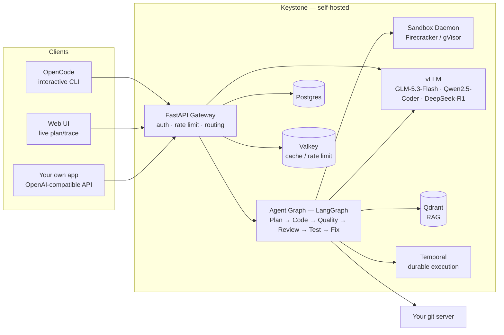

# Keystone

**Self-hosted LLM inference gateway and autonomous coding agents — open source, air-gap-capable, zero managed SaaS.**

[](https://github.com/GGChamp85/keystone/actions/workflows/ci.yml)
[](https://github.com/GGChamp85/keystone/actions/workflows/codeql.yml)
[](LICENSE)
[](pyproject.toml)
[](web/package.json)

Keystone runs entirely on infrastructure you own: an OpenAI-compatible inference gateway in front of open-weight models (GLM-5.3-Flash, Qwen2.5-Coder, DeepSeek-R1), and an autonomous coding agent that explores your real repository with tools — reading, grepping, editing, running tests — instead of guessing at full-file rewrites from memory. No model weights, code, or telemetry ever leave your network unless you choose to send them.

---

## Contents

- [Why Keystone](#why-keystone)
- [Architecture](#architecture)
- [What you need](#what-you-need)
- [Watch it write code](#watch-it-write-code)
- [Run it locally in 10 minutes](#run-it-locally-in-10-minutes)
- [Use it](#use-it)
- [Connect your own git server](#connect-your-own-git-server)
- [Deploy air-gapped](#deploy-air-gapped)
- [Fine-tune on your code](#fine-tune-on-your-code)
- [Run the benchmark suite](#run-the-benchmark-suite)
- [Models](#models)
- [Tech stack](#tech-stack--open-source-only-no-managed-saas)
- [Project structure](#project-structure)
- [Documentation](#documentation)
- [Contributing](#contributing)
- [License](#license)

---

## Why Keystone

- **Self-hosted, not a wrapper around someone else's API.** Every model, every sandbox, every database runs on infrastructure you control. The [tech stack](#tech-stack--open-source-only-no-managed-saas) table below lists every dependency and its verified license — nothing here is "open core" with a managed cloud upsell.
- **A real agentic coding loop, not a JSON-envelope rewrite.** The coding agent reads and edits your repository with actual tools (`read_file`, `grep`, `apply_patch`, `run_command`) against a real sandboxed git clone, the same way a human contributor would — not by generating a full replacement file from a prompt and hoping it's still correct.
- **Fails closed, not open.** A code review the model couldn't complete, a quality gate that couldn't run, a test the sandbox couldn't execute — every one of these blocks the task rather than silently waving it through. Nothing gets labeled "reviewed" or "tested" that wasn't.
- **Air-gap-capable by construction.** The offline bundle scripts (`airgap/`) package every container image, Python wheel, npm package, and model weight your deployment needs, so a fully network-isolated environment can run the whole platform with zero internet egress after import.

---

## Architecture



A background agent task moves through the graph above — `PLANNING → CODING → QUALITY → REVIEW → TESTING → COMPLETE`, with a `FIXING` node that every gate can route back to on failure (including a root-cause step that decides whether to re-plan entirely after repeated failures, not just retry blindly). Temporal makes this durable: a task survives an API pod crash or restart because Temporal owns the execution, not an in-process task.

---

## What you need

| Component | Needed for | Notes |
|---|---|---|
| Docker + Compose v2, `make` | Everything | The whole stack is `docker-compose.yml` |
| Postgres, Redis/Valkey, Qdrant | Everything | Started for you by `make up` — nothing to install separately |
| Sandbox daemon (`keystoned`) | Any agentic coding task (not plain chat completions) | Runs sandboxed git clones/tool calls/tests; gVisor by default, no KVM needed. `make sandbox-images` builds its runtime image — required before the first task |
| **A git host** | Agentic coding tasks (chat-only use doesn't need one) | Keystone never invents a repo to work in — point it at your own git server, or run [Gitea](https://gitea.io) (MIT) in five minutes for a local/test one. See [Connect your own git server](#connect-your-own-git-server) |
| **A coding model** | Everything model-related | Either (a) GPUs running vLLM — see [Models](#models) for real VRAM numbers, or (b) **no GPU at all**: `benchmarks/frontier_proxy.py` puts a real frontier model (Claude, today) behind the same OpenAI-compatible interface — this is what [Watch it write code](#watch-it-write-code) below uses |

That's the complete list — no managed SaaS dependency anywhere in it (see [Tech stack](#tech-stack--open-source-only-no-managed-saas)).

---

## Watch it write code

The fastest path to seeing Keystone actually fix a bug — no GPU required, using a real frontier model as the coding backend via `benchmarks/frontier_proxy.py` (real translation layer, not a mock — see [Run the benchmark suite](#run-the-benchmark-suite) for the proof this genuinely works: a real bug, solved end to end, independently verified).

```bash
# 1. Clone, configure, and point the coding role at a real frontier model
#    instead of a GPU — all *before* bringing the stack up, since the app
#    container reads VLLM_CODING_URL from .env at startup, not your shell.
git clone https://github.com/GGChamp85/keystone.git && cd keystone
cp .env.example .env
# Edit .env: set POSTGRES_PASSWORD, REDIS_PASSWORD, QDRANT_API_KEY,
# KEYSTONE_ROOT_ADMIN_TOKEN, and GIT_ALLOWED_HOSTS/GIT_HOST_API_URL/
# GIT_HOST_TOKEN for a real git host it can clone/push/PR against (see
# "Connect your own git server" below — Keystone never invents a repo).
# Set VLLM_CODING_URL=http://host.docker.internal:8090/v1 (Docker Desktop;
# on Linux see the comment above that line in .env.example).

# 2. Bring up the stack (Postgres, Redis, Qdrant, the app, the sandbox daemon)
make certs && make build && make up && make db-migrate
make sandbox-images     # sandbox runtime image — required before any task can run

# 3. Start the real frontier-model proxy the .env above points at
export ANTHROPIC_API_KEY=sk-ant-...
FRONTIER_PROXY_MODEL=claude-opus-4-6 python -m benchmarks.frontier_proxy &   # serves on :8090

# 4. Create an API key and submit a real task
make api-key
curl -X POST http://localhost:8080/v1/keystone/tasks \
  -H "Authorization: Bearer ks-XXXX-XXXXXXXX" -H "Content-Type: application/json" \
  -d '{"task": "Fix the bug where ...", "repository_url": "https://<your-git-host>/you/your-repo", "model": "coding"}'

# 5. Watch it work
open http://localhost:8080/app/    # live plan → tool calls → quality gates → review → tests, streaming in
```

What happens next is the real agent loop, not a canned response: it clones the repo into a sandbox, reads and greps the real code, writes a patch with real tools, runs lint/typecheck/security scanners, gets reviewed by a second model pass, runs the repo's real test suite, and — only if every one of those actually passed — commits, pushes a branch, and opens a real pull request for you to read like any other contributor's PR.

Prefer a terminal session over a background task, the way you'd use Claude Code or the Codex CLI interactively? See [Work from the terminal](#use-it) below — [OpenCode](https://github.com/sst/opencode) pre-configured against Keystone gives you exactly that, same real tools, same models.

---

## Run it locally in 10 minutes

This brings up the full stack (no model backend chosen yet — see [What you need](#what-you-need) for the two real options, and [Watch it write code](#watch-it-write-code) if you want to skip straight to a working agentic task with no GPU).

```bash
# 1. Clone and configure
git clone https://github.com/GGChamp85/keystone.git
cd keystone
cp .env.example .env
# Edit .env: set POSTGRES_PASSWORD, REDIS_PASSWORD, QDRANT_API_KEY,
# KEYSTONE_ROOT_ADMIN_TOKEN — the compose file refuses to start without them.

# 2. TLS
make certs        # bare self-signed leaf — fine for a laptop
# make certs-ca    # real internal CA + CA-signed cert (pki/) — use this for anything shared

# 3. Build and start
make build         # also builds the sandbox runtime images (required before any agent task can run)
make up

# 4. Migrate the database
make db-migrate

# 5. Create your first API key
make api-key       # prompts for a tenant name, prints a ks-... key — save it

# 6. Confirm it's alive
curl http://localhost:8080/health
```

Expected output from step 6 is a JSON body with `"status": "ok"` and a `components` map showing each backing service (`postgres`, `redis`, `qdrant`, `vllm_coding`, ...) as `healthy` or `unhealthy` — an `unhealthy` vLLM component just means no model endpoint is reachable yet, which is expected until you've pointed one at real GPUs or an external endpoint.

Then open the live UI and watch an agent actually work:

```bash
open http://localhost:8080/app/   # paste your API key, submit a task, watch the plan/tool-trace stream in
```

**Troubleshooting**: `keystone doctor` (`src/cli/doctor.py`) is the real diagnostic — it connects directly to Postgres, Redis, Qdrant, the sandbox daemon, each model endpoint, the git host, and package mirrors (independent of whether the app itself is even up yet) and reports exactly what's wrong, not just pass/fail. `make status` shows every container's health; `make logs` / `make logs-vllm` tail application/model logs; `make vllm-status` checks model endpoint health specifically; `make clean` tears down containers, volumes, and cached data for a clean retry.

---

## Use it

Three ways in, depending on what you want — a raw completion, an autonomous background task, or an interactive terminal session:

### Chat completions (OpenAI-compatible)

Point any OpenAI SDK/client at Keystone by swapping the base URL — no agent, no tools, just a completion:

```bash
curl -X POST http://localhost:8080/v1/chat/completions \
  -H "Authorization: Bearer ks-XXXX-XXXXXXXX" \
  -H "Content-Type: application/json" \
  -d '{
    "model": "coding",
    "messages": [{"role": "user", "content": "Write a Python async Redis connection pool"}],
    "temperature": 0.2
  }'
```

### Background coding task (the agentic path — see [Watch it write code](#watch-it-write-code) for the full walkthrough)

The agent clones the repo into a sandbox, explores it with real tools, edits it, runs quality gates and the real test suite, and opens a PR — you submit it and come back to a review, like assigning a task to a contributor:

```bash
curl -X POST http://localhost:8080/v1/keystone/tasks \
  -H "Authorization: Bearer ks-XXXX-XXXXXXXX" \
  -H "Content-Type: application/json" \
  -d '{
    "task": "Add pagination to the /users endpoint with cursor-based navigation",
    "repository_url": "https://<your-git-server>/myorg/myapi",
    "model": "coding",
    "max_iterations": 10
  }'
```

### Interactive terminal session

[OpenCode](https://github.com/sst/opencode), pre-configured against Keystone (`cli/opencode.config.json`), gives a Claude-Code-style interactive agent — the same real tools and models, but you drive it turn by turn instead of submitting a task and walking away:

```bash
opencode
# Provider "Keystone Inference" is pre-registered; Shift+Tab cycles manual/auto-mode.
```

See `docs/deployment/OPENCODE_SETUP.md` for wiring OpenCode to a non-local Keystone deployment.

---

## Connect your own git server

The agent's repo-mode tasks (clone → branch → commit → push → PR) only ever talk to git hosts you explicitly allow — `GIT_ALLOWED_HOSTS` in `.env` (default: a placeholder `gitea.internal.keystone.local`, since Gitea is the reference internal git host used throughout the air-gap tooling and dev-tier `docker-compose.yml`). Point it at whatever your org already runs:

```bash
# .env
GIT_ALLOWED_HOSTS=git.yourcompany.internal
GIT_HOST_API_URL=https://git.yourcompany.internal/api/v1
GIT_HOST_TOKEN=<a bot account token with push + PR permissions>
```

`src/git/host.py` defines the `GitHost` protocol; `src/git/gitea.py` is the current real implementation. A repository URL outside the allowlist is rejected before the agent ever clones it — this is an allowlist, not a warning.

---

## Deploy air-gapped

Production deployments are built to run fully air-gapped: zero internet egress after the offline bundle is transferred in.

```bash
# On a machine WITH internet access:
./airgap/download_models.sh ./airgap/models        # model weights — DeepSeek-R1 (~688GB) and GLM-5.3-Flash (~328GB) dominate the size, budget accordingly
./airgap/build_image_bundle.sh ./airgap/output/images   # every container image, re-tagged for your internal registry
# then the Python wheelhouse / npm mirror scripts, per docs/airgap/OFFLINE_INSTALL_RUNBOOK.md

# Transfer ./airgap/output (and the model bundle) into the isolated environment, then:
./airgap/import_bundle.sh
```

`docs/airgap/OFFLINE_INSTALL_RUNBOOK.md` walks the full build → bundle → transfer → import → bring-up sequence step by step, and states plainly what's been verified end-to-end on a real network-isolated environment versus what still needs a smoke test before a production handoff — it doesn't paper over the gap.

---

## Fine-tune on your code

The full pipeline is real and wired end to end: real training-data sources, a real adapter registry, real LoRA serving, and a real web wizard — not just standalone trainer scripts.

**From the web UI** (the easiest path — `http://localhost:8080/app/`, "Fine-tune" tab): pick a job type and base model, point it at a real training-data JSONL, watch live progress stream in, see the real metrics and a dataset preview, then promote or roll back the resulting adapter with one click.

**From the CLI**:

```bash
keystone finetune start lora Qwen/Qwen2.5-Coder-32B-Instruct /data/finetune/train.jsonl --set num_epochs=3
keystone finetune watch <job-id>       # live progress until it reaches a terminal status
keystone finetune promote <job-id>     # register as the tenant's default adapter for its base model
keystone finetune rollback <job-id>    # retire it — routing falls back to the base model
```

**Real data sources** (`src/finetuning/sources/`) turn what your team already has into training data — no separate labeling effort:

- `git_history.py` — merged commits/PR title+body → instruction, real diff → response, filtered for size, generated paths, and secrets.
- `trajectories.py` — your team's own accepted/merged Keystone Agents tasks → SFT examples in the exact prompt/tool format the agent itself uses; accepted-vs-rejected and tests-passed-vs-failed pairs → DPO.
- `repo_pretrain.py` — continued-pretraining text from your indexed repositories, deduped by content hash.

`src/finetuning/manifest.py` splits every dataset into train/holdout **stratified by repository** (never leaking one repo's examples across the split) and writes a `manifest.json` with real sha256 hashes of every file, shown to you before training starts. Trainers (`lora_train.py`/`sft_train.py`/`dpo_train.py`) track real `eval_loss` against the holdout split and keep the best checkpoint, not just the last one.

Once a job completes, promoting it writes a real row to the adapter registry (`ModelAdapter` — tenant, base model, path, status, one `is_default` per tenant+base-model) and every real inference call site — chat completions, the coding/review/planning nodes, extraction — resolves and routes to it automatically (`src/inference/model_router.py`), with the matching `--enable-lora --lora-modules ...` flags emitted for vLLM to actually serve it (`src/inference/config.py`).

> **Where this genuinely stands today**: all of the above is real and covered by tests against real Postgres/Redis — including a CPU LoRA smoke run with a 0.5B model proving the trainer→registry→router path end to end in this GPU-less dev environment. Two things are still open, honestly: no adapter has been trained on real GPU hardware yet (the trainers use `bitsandbytes` 4-bit quantization, which needs one), and promotion is currently a manual human decision — the plan's "only promote if it measurably beats base+RAG on held-out tasks" auto-verdict gate isn't wired up yet. See `ROADMAP.md`'s Phase 5.

---

## Run the benchmark suite

```bash
python -m benchmarks.run_benchmark                    # Keystone Inference only
python -m benchmarks.run_benchmark --with-frontier     # + any frontier models you've configured API keys for
python -m benchmarks.run_benchmark --gpu-count 4 --gpu-hourly-cost 1.89 --gpu-tokens-per-second 4000
```

Each task in `benchmarks/tasks/` is scored by actually executing the model's completion in a real self-hosted sandbox (gVisor) — no LLM-as-judge, no heuristic string match, just the real test command's real exit code — and the runner reports pass rate alongside a real token-cost comparison (self-hosted GPU-time vs. any frontier model you included). Requires `SANDBOX_DAEMON_URL` reachable and either `VLLM_CODING_URL` reachable or `--with-frontier` with a key set; with neither, it reports "no models available" rather than fabricating a result.

**A real run, from this repo's own development environment** (no GPU available here, so `keystone-inference` fails honestly rather than being skipped or faked; `--with-frontier` was set with a real `ANTHROPIC_API_KEY`):

| Model | Pass rate | Notes |
|---|---|---|
| `keystone-inference` | 0/3 | Real, honest failure — no vLLM endpoint reachable in this dev environment (no GPU). Not a fabricated 0; the harness reports "no models available" style errors per-task rather than a silent skip. |
| `claude-opus` | 3/3 | Real Anthropic API call, real sandboxed test execution. |
| `claude-sonnet` | 3/3 | Same. |

**Read this result for what it is, not more**: this is a 3-task single-function smoke suite that exists to prove the harness itself — sandboxed execution, real cost accounting, gated frontier clients — is genuinely wired end to end, not a claim that Keystone's self-hosted models match or beat frontier models. No number in this README is invented; where a real measurement doesn't exist yet, the roadmap says so instead of guessing.

### The real repo-scale benchmark

`benchmarks/agent_runner.py` is the actual thing a quality comparison needs: a repo-scale task run through the *real* agent loop (`src/orchestrator/engine.py`'s real engine, real tools, real quality gates, a real git workflow) against a seeded repository with a genuine bug and a real failing test — not a single free-standing completion.

```bash
python -m benchmarks.agent_runner --task token_bucket --max-iterations 8
```

To use a real frontier model as the coding backend for this, `benchmarks/frontier_proxy.py` translates `src/inference/client.py`'s exact OpenAI-compatible wire protocol to and from the real Anthropic Messages API — point `VLLM_CODING_URL` at it and the unmodified orchestrator runs against Claude:

```bash
FRONTIER_PROXY_MODEL=claude-opus-4-6 python -m benchmarks.frontier_proxy   # serves on :8090
export VLLM_CODING_URL=http://localhost:8090/v1
```

**Run for real** against a live Gitea, a live sandbox, and Claude: the seeded `token_bucket` task (a token-bucket rate limiter whose `_refill()` doesn't cap tokens at capacity) was **solved in 67.6s across 5 iterations** — real planning, real tool-based coding, real quality gates, real review, real tests, a real push, and a real PR opened — independently confirmed by cloning the pushed branch in a *fresh* sandbox and re-running both the fail-to-pass and pass-to-pass tests, both passing. Requires `GIT_HOST_API_URL`/`GIT_HOST_TOKEN`/`GIT_ALLOWED_HOSTS` pointed at a real Gitea reachable from inside a sandbox (see `tests/test_git_workflow_integration.py`'s module docstring for how to stand one up).

**Still honestly incomplete**: only one repo task exists so far (the plan calls for 10–20), there's no persisted comparison sweep yet (base vs. base+RAG vs. fine-tuned vs. frontier, all through this same harness), and no web UI comparison panel — see `ROADMAP.md`'s Phase 6.

---

## Models

| Role | Model | GPUs | Context |
|------|-------|------|---------|
| Coding (primary) | [GLM-5.3-Flash](https://huggingface.co/zai-org/GLM-5.3-Flash) (zai-org, MIT) — 288-expert MoE, natively FP8, real max context 1,048,576 | 8× A100/H100 80GB | 128K default (raise once real KV-cache headroom is confirmed) |
| Coding (fallback) | Qwen2.5-Coder-32B-Instruct (Apache-2.0) — used when the primary endpoint is unhealthy | 4× A100 80GB | 128K |
| Reasoning (critic) | DeepSeek-R1 (MIT) | 2× A100 80GB | 64K |

Swapping in a different model is a config change, not a code change — see `src/inference/config.py` and `src/inference/model_router.py`.

**Distributed serving** (`helm/keystone/templates/vllm.yaml`): each role scales along two independent, real axes — `replicas` runs N independent full model instances behind a load-balanced Service for horizontal throughput, and `nodeCount` pipeline-parallels a single instance across that many physical nodes for a model too large for one node's GPU pool (vLLM's real Ray-backed multi-node executor). Optional KEDA-based autoscaling scales `replicas` on the real `vllm:num_requests_waiting` queue-depth metric, not a CPU percentage that would never trigger on a GPU-bound workload. All three paths (single-node, multi-node, autoscaling) render through `helm lint`/`helm template` in CI on every PR; the multi-node Ray bootstrap itself hasn't been verified against real multi-node GPU hardware yet — this dev environment has none.

---

## Tech stack — open source only, no managed SaaS

Every row is an actual service this repo deploys, with its license verified against the real upstream source (not assumed) — see `docs/LICENSES_AND_COMPLIANCE.md` for the full inventory and every finding that changed the build.

| Layer | Technology | License |
|-------|-----------|---------|
| API Gateway | FastAPI + Uvicorn | MIT |
| Orchestration | LangGraph | MIT |
| Model Serving | vLLM | Apache-2.0 |
| Vector DB (RAG) | Qdrant | Apache-2.0 |
| Sandbox | Self-hosted — gVisor by default (portable, no nested virtualization required), Firecracker microVMs for production tiers with KVM-capable nodes | Apache-2.0 |
| Interactive Agent CLI | [OpenCode](https://github.com/sst/opencode) | MIT |
| Durable Execution | Temporal.io | MIT |
| Secrets | OpenBao | MPL-2.0 |
| IaC | OpenTofu + Helm | MPL-2.0 / Apache-2.0 |
| Distributed training | Kubeflow Trainer | Apache-2.0 |
| Autoscaling (optional, `vllm.*.autoscaling.enabled`) | [KEDA](https://keda.sh) | Apache-2.0 (verified against the real upstream `LICENSE`) |
| Metrics + dashboards | Prometheus + Grafana | Apache-2.0 / **AGPL-3.0** (Grafana — see `docs/LICENSES_AND_COMPLIANCE.md` finding #2) |
| Log aggregation + alerting | Loki + Promtail + Alertmanager | AGPL-3.0 (Loki/Promtail, same caveat as Grafana) / Apache-2.0 |
| Database | PostgreSQL 16 | PostgreSQL License |
| Cache / rate-limit / queues | **Valkey** (not Redis — `redis:7-alpine` now resolves to a relicensed, non-open-source build; see finding #1) | BSD-3-Clause |
| Reverse Proxy | Nginx (TLS 1.3, real internal CA via `pki/`) | BSD-2-Clause |

**Not included — bring your own**: an internal git server (see [Connect your own git server](#connect-your-own-git-server)) and a container registry for the air-gapped image bundle (`global.imageRegistry` in `helm/keystone/values.yaml`; Harbor is a reasonable choice, but this repo doesn't deploy one).

---

## Project structure

```
keystone/
├── src/
│   ├── main.py                    # FastAPI app entry point
│   ├── config.py                  # Pydantic settings
│   ├── api/
│   │   ├── routes/                # health, completions, keys (admin), agents, memory, finetune, mcp
│   │   ├── middleware/            # Bearer API key auth + RBAC, Valkey rate limiter/budgets
│   │   └── models/                # Pydantic request/response schemas
│   ├── db/                        # SQLAlchemy models + Alembic migrations
│   ├── inference/                 # vLLM client, model router (role/tenant → endpoint + adapter + fallback), config builder
│   ├── orchestrator/
│   │   ├── engine.py              # Task lifecycle manager (Temporal-backed)
│   │   ├── graph.py               # LangGraph state graph
│   │   ├── circuit_breaker.py     # Runaway loop protection
│   │   ├── concurrency.py         # Per-tenant/per-user Redis semaphore
│   │   ├── context.py             # Token-budgeted prompt/turn trimming
│   │   ├── events.py              # Live task event stream (Redis Streams -> SSE, powers web/)
│   │   ├── pr_polling.py          # Automatic PR-status -> task_feedback recording
│   │   ├── tools/                 # Tool schemas, real implementations, native/text protocol
│   │   └── nodes/                 # planning / coding / quality / review / testing / tool_execution
│   ├── sandbox/                   # Sandbox daemon + Firecracker/gVisor backends, egress policy
│   ├── git/                       # GitHost protocol + Gitea implementation
│   ├── rl/                        # RL rollout coordinator (reuses the sandbox pool)
│   ├── temporal/                  # worker.py, workflows.py, activities.py, finetune_workflow.py, finetune_activities.py
│   ├── memory/                    # Per-tenant Qdrant vector store, embeddings, incremental git ingestion
│   ├── finetuning/                # LoRA/SFT/DPO trainers, runner, events, sources/ (git history, trajectories, repo pretrain), manifest
│   └── cli/                       # `keystone` CLI (memory, finetune) — a real HTTP client against the API
├── cli/                           # OpenCode config for the interactive agent
├── web/                           # Live plan/execution-trace + memory + fine-tune UI (React + Vite, served at /app)
├── helm/keystone/                 # Kubernetes chart (client VPC production)
├── infra/opentofu/                # RunPod test tier (assembled environment) + reusable modules (incl. client-vpc-network)
├── airgap/                        # Offline bundle build/import scripts
├── pki/                           # Internal CA
├── observability/                 # Prometheus + Grafana provisioning (dev tier)
├── benchmarks/                    # Quality + cost benchmark runner
├── docs/                          # Runbooks, architecture, compliance
├── docker-compose.yml             # Single-box dev deployment
└── LICENSE / NOTICE
```

---

## Documentation

| Doc | Covers |
|---|---|
| `docs/airgap/OFFLINE_INSTALL_RUNBOOK.md` | Build → bundle → transfer → import → bring-up, step by step |
| `docs/architecture/SANDBOX_ARCHITECTURE.md` | How the Firecracker/gVisor sandbox layer actually works |
| `docs/deployment/KUBERNETES_CLIENT_VPC.md` | Helm install, and what's verified on a real cluster vs. not |
| `docs/deployment/OPENCODE_SETUP.md` | Wiring the interactive CLI to Keystone |
| `docs/LICENSES_AND_COMPLIANCE.md` | Full license inventory + every real finding that changed the build |
| `docs/TELEMETRY_AUDIT.md` | Every telemetry-disabling setting, verified inert |
| `ROADMAP.md` | What's built, what's next |
| `CHANGELOG.md` | Notable changes, [Keep a Changelog](https://keepachangelog.com/) format |

### Deployment tiers

| Tier | Use case | How |
|------|----------|-----|
| Single-box dev | Local development, demos | `docker-compose.yml` (`make up`) |
| RunPod test/staging | Multi-GPU testing before rollout | `infra/opentofu/environments/runpod-test/`, `helm/keystone/values-runpod-test.yaml` |
| Client VPC production | Air-gapped, multi-node, inside your own network | `helm/keystone/` Kubernetes chart with `helm/keystone/values-client-vpc.yaml`, plus the reusable `infra/opentofu/modules/client-vpc-network/` module (no fully assembled `environments/` entry for this tier yet — see `docs/deployment/KUBERNETES_CLIENT_VPC.md` for what's verified) |

---

## Contributing

Bug reports, feature requests, and PRs are welcome — see `CONTRIBUTING.md` for dev setup and the PR checklist, `CODE_OF_CONDUCT.md` for community expectations, and `SECURITY.md` for how to report a vulnerability privately rather than through a public issue.

---

## License

Apache License 2.0 — see [LICENSE](LICENSE) and [NOTICE](NOTICE) for the full text and third-party attributions.
